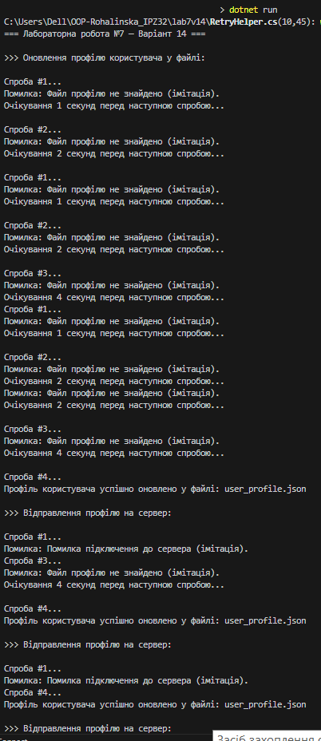
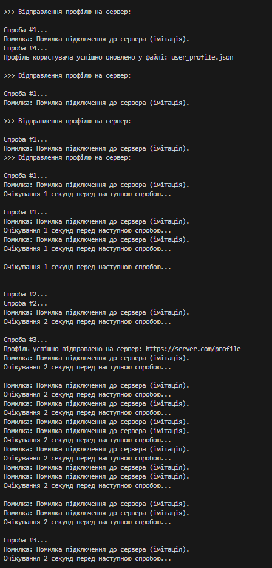
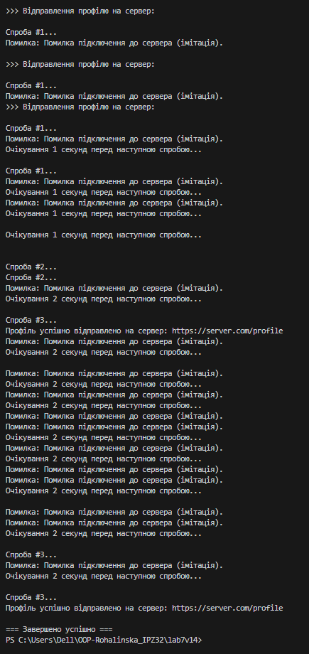

# Лабораторна робота 
## Тема:
Обробка IO/мережевих помилок та патерн Retry  

### Варіант 14 — Оновлення профілю користувача

### Мета роботи
Навчитися обробляти помилки вводу/виводу та мережеві помилки, використовувати `try-catch-finally`, а також реалізувати патерн **Retry** з експоненційною затримкою.

## Реалізовані класи

### **1. RetryHelper**
Універсальний клас, який дозволяє повторювати будь-яку операцію кілька разів у разі помилки.  
Підтримує:
- експоненційну затримку,
- логування спроб,
- вибіркове повторення через `shouldRetry`.

## Скрін запуску

