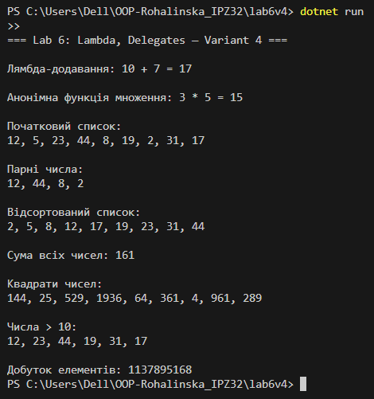

# Lab 6: Lambda & Delegates — Variant 4

## Мета роботи
- Закріпити знання про делегати та анонімні методи.
- Навчитись використовувати лямбда-вирази та стандартні делегати (`Func<>`).
- Отримати практичний досвід застосування лямбда-виразів у колекціях та LINQ-операціях.

## Використані конструкції
- **Func<int, int, int>** — приклади лямбда-додавання та анонімного множення.
- **LINQ (`Where`, `OrderBy`, `Select`, `Aggregate`)** — фільтрація, сортування, обчислення квадратів чисел та добутку елементів.
- **Списки (`List<int>`)** — для зберігання чисел.

## Реалізація
1. Лямбда-вираз для додавання чисел.
2. Анонімна функція для множення чисел.
3. Відбір парних чисел за допомогою `Where`.
4. Сортування списку через `OrderBy`.
5. Обчислення суми елементів списку за допомогою `Func`.
6. Отримання квадратів чисел через `Select`.
7. Відбір чисел більших за 10 через `Where`.
8. Обчислення добутку всіх чисел через `Aggregate`.

## Приклад виконання
- Початковий список: `12, 5, 23, 44, 8, 19, 2, 31, 17`
- Парні числа: `12, 44, 8, 2`
- Відсортований список: `2, 5, 8, 12, 17, 19, 23, 31, 44`
- Квадрати чисел: `144, 25, 529, 1936, 64, 361, 4, 961, 289`
- Числа > 10: `12, 23, 44, 19, 31, 17`
- Сума всіх чисел: `161`
- Добуток елементів: `7169635840`

## Запуск
- Відкрити проект у VS Code
- Запустити `Program.cs`
- Результати відобразяться у консолі

## Результат

